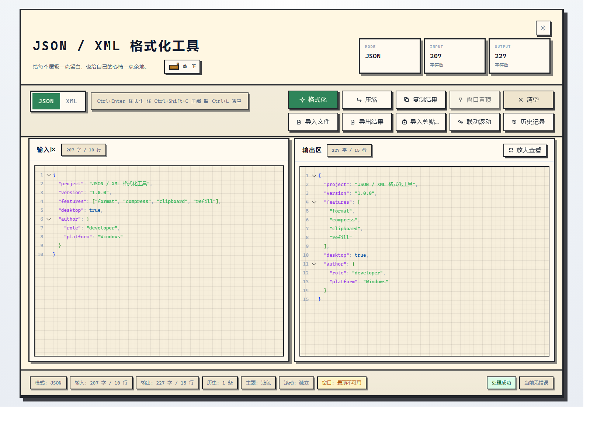
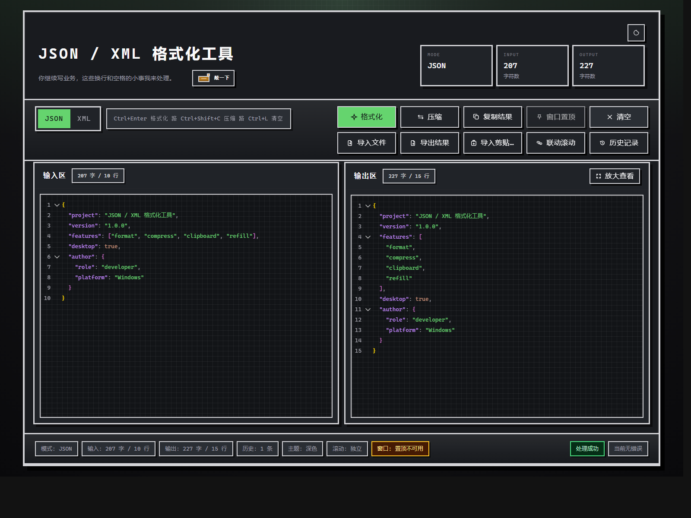
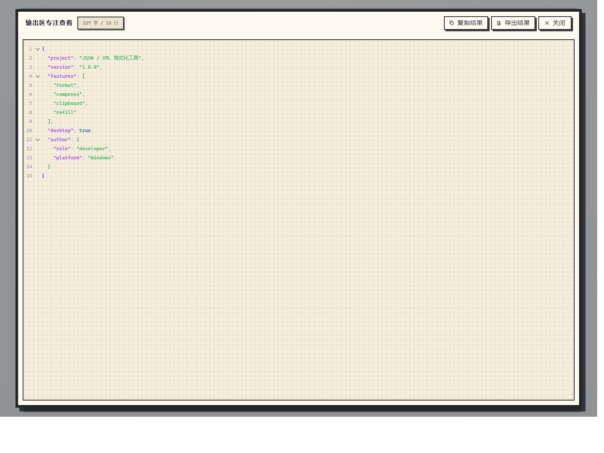

# 开发者工具箱

一个面向程序员日常使用的桌面工具箱，当前内置：

- `JSON / XML` 格式化工作台
- 结构化文本代码比对工作台
- `Cron` 表达式生成与反解析工作台
- `SQL` 格式化与压缩工作台

项目基于 `Tauri + React + TypeScript + Tailwind CSS + Monaco Editor` 构建，目标是提供一个真正顺手、打开即用、离线可用的桌面应用，而不是临时拼出来的网页 Demo。

## 界面预览

### 主界面



### 深色主题



### 输出区专注查看



## 工作台概览

### 1. 格式化工作台

适合快速处理接口响应、配置片段和临时结构化文本。

- 支持 `JSON` 格式化与压缩
- 支持 `XML` 格式化与压缩
- 支持 `JSON / XML` 手动切换
- 支持自动识别输入内容类型
- 支持输入区与输出区双栏编辑
- 支持输出区专注查看弹层
- 支持系统剪贴板导入与复制结果
- 支持文件导入、拖拽导入与结果导出
- 支持快捷键操作
- 支持历史记录恢复
- 支持联动滚动

### 2. 代码比对工作台

适合对比接口返回、配置文件、JSON 片段和 XML 文本差异。

- 支持 `JSON / XML / 文本` 三种对比模式
- 支持自动识别结构化文本类型
- 支持 Monaco 双栏差异编辑器
- 支持左右分栏与内联视图切换
- 支持左右内容互换
- 支持忽略空白差异
- 支持左右侧独立文件导入
- 支持差异块、新增、删除、修改统计
- 支持先格式化后再对比

### 3. Cron 工作台

适合生成常见调度表达式、理解现有 Cron 规则并预览后续执行时间。

- 支持每分钟、每小时、每天、每周、每月、自定义表达式
- 支持可视化生成 `5` 段标准 Cron 表达式
- 支持反解析表达式并回填到可视化配置
- 支持中文说明生成
- 支持未来 `5` 次执行时间预览
- 支持模板快速套用
- 支持从剪贴板导入与复制表达式

### 4. SQL 工具工作台

适合快速整理查询语句、压成单行后复制到日志或配置中继续使用。

- 支持 SQL 格式化
- 支持 SQL 单行压缩
- 支持 SQL 全量转大写 / 转小写
- 支持输入区与输出区双栏编辑
- 支持复制结果
- 支持输出区专注查看弹层
- 支持历史记录恢复
- 当前版本暂未开放文件导入、拖拽导入、剪贴板一键导入与结果导出

## 核心特性

- 桌面端离线可用
- 工作台切换式交互，首页更聚焦
- 首页支持方向键、`Home / End / Enter` 键盘导航
- 浅色 / 深色主题切换
- 原生文件选择、保存与拖拽导入
- 文件与拖拽导入当前主要用于格式化工作台与代码比对工作台
- 系统剪贴板集成
- 窗口置顶
- 历史记录恢复
- 面向长文本的 Monaco 编辑体验

## 快捷键

### 通用

- `Ctrl + L`：清空当前工作台内容

### 格式化工作台

- `Ctrl + Enter`：执行格式化
- `Ctrl + Shift + C`：执行压缩
- `Ctrl + Shift + V`：从剪贴板导入

### 代码比对工作台

- `Ctrl + Enter`：整理左右内容后再比对
- `Ctrl + Shift + V`：向当前激活侧导入剪贴板内容

### Cron 工作台

- `Ctrl + Enter`：反解析当前表达式
- `Ctrl + Shift + C`：复制当前 Cron 表达式
- `Ctrl + Shift + V`：从剪贴板导入表达式

### SQL 工具工作台

- `Ctrl + Enter`：执行 SQL 格式化
- `Ctrl + Shift + C`：执行 SQL 单行压缩
- `Ctrl + L`：清空当前 SQL 输入与输出

## 适用场景

- 格式化接口返回的 `JSON`
- 快速整理和查看 `XML` 片段
- 对比两份接口结果、配置文件或结构化文本差异
- 处理日志中的压缩内容并重新格式化
- 生成常见任务调度表达式
- 反向理解已有 `Cron` 表达式的执行含义
- 格式化和压缩临时 `SQL` 查询语句
- 在桌面环境下快速处理临时字符串，而不依赖在线工具

## 技术栈

- Tauri
- React
- TypeScript
- Tailwind CSS
- Monaco Editor
- fast-xml-parser
- sql-formatter
- xml-formatter

## 本地开发

### 1. 安装依赖

```bash
npm install
```

### 2. 启动前端预览

```bash
npm run dev
```

默认访问地址：

- [http://127.0.0.1:1420](http://127.0.0.1:1420)

### 3. 启动 Tauri 桌面开发模式

```bash
npm run tauri:dev
```

## 构建与发布

### 构建前端资源

```bash
npm run build
```

### 构建桌面应用

```bash
npm run tauri:build
```

### 运行完整校验

```bash
npm run verify
```

### 仅构建免安装可执行文件

```bash
npx tauri build --no-bundle
```

### 运行标准化便携版发布流程

```bash
npm run release:portable
```

执行完成后，会在 `release/` 目录下生成标准化便携版产物。

## 运行环境

推荐环境：

- Node.js 20+
- Rust stable
- Windows 下安装 Microsoft C++ Build Tools

Rust 安装地址：

- [https://www.rust-lang.org/tools/install](https://www.rust-lang.org/tools/install)

## 项目结构

```text
format-tools/
  docs/
    screenshots/
  src/
    components/
    hooks/
    types/
    utils/
    App.tsx
    main.tsx
    index.css
  src-tauri/
    capabilities/
    icons/
    src/
    Cargo.toml
    tauri.conf.json
  assets/
  public/
  scripts/
  package.json
  README.md
```

## 主要模块说明

- `src/components`
  负责工作台界面、工具栏、编辑区、历史记录、差异视图、Cron 配置面板、SQL 工具栏与弹层
- `src/hooks`
  封装格式化、代码比对、Cron 工作台、SQL 工作台、剪贴板、文件传输、主题、快捷键等逻辑
- `src/utils`
  负责 JSON / XML / SQL 处理、Cron 解析、错误整理、文本统计、Monaco 配置等工具函数
- `src-tauri`
  负责桌面壳层、权限配置、图标资源与原生插件接入
- `scripts`
  负责清理、编码检查、标准化发布等工程脚本

## 当前版本特点

当前版本重点覆盖程序员高频使用的四类桌面场景：

- 临时结构化文本的格式化、压缩、复制与导出
- 两份文本或结构化内容的差异查看
- 常见 `Cron` 表达式的生成、反解析与执行预览
- 临时 `SQL` 语句的格式化、一行压缩、大小写转换与复制

这一版的产品形态已经从单一格式化器升级为多工作台开发者工具箱：

- 首页只负责切换工作台，避免一次堆太多控件
- 首页卡片支持键盘高亮和回车进入
- 每个工作台都有独立工具栏和状态反馈
- 错误会尽量转成可读信息，而不是直接抛技术堆栈
- 桌面能力统一走原生文件、剪贴板和窗口接口

## 仓库级工程护栏

为了减少编码问题和发布漂移，仓库里补了这些保护：

- `.editorconfig`
  统一 UTF-8、换行与缩进风格
- `.gitattributes`
  规范文本文件与二进制文件行为
- `npm run check:encoding`
  检查 BOM、替换字符和常见乱码痕迹
- `npm run release:portable`
  统一清理、校验、构建和便携版产物输出流程

## 后续可扩展方向

- 多标签页处理
- 更强的结构树视图
- 历史记录搜索与收藏
- 语义级 JSON / XML 差异对比
- Quartz / 秒级 Cron 支持
- 更多主题风格
- 更多导入导出格式
- 自动更新与版本发布流程

## License

当前仓库还没有附带正式开源协议。

如果准备公开分发或对外开源，建议补充明确的 `LICENSE` 文件。
